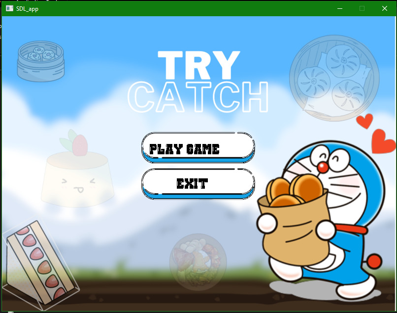
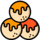
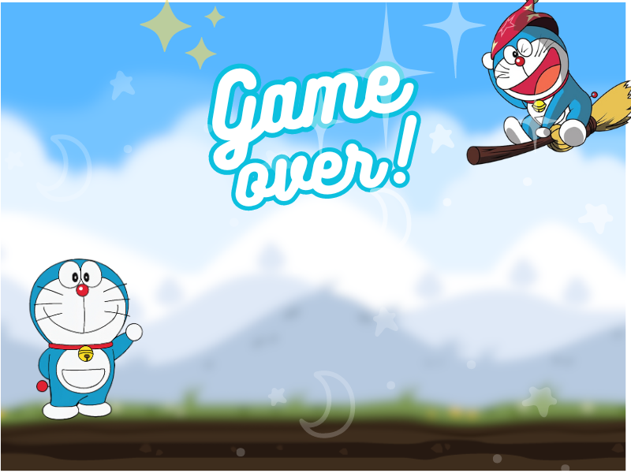

[[English]](README_en.md)

# Try Catch - HoangHaiUET

- Thử nghiệm game: [............................](.......)
- Phá đảo game: .................................

# Giới thiệu game

Try_Catch là 1 game thuộc thể loại Catch Fruit . Nhiệm vụ của bạn là điều khiển chú mèo máy Doraemon tới những vị trí thích hợp để nhặt được những chiếc bánh đồng thời né tránh những quả bom gây nguy hiểm cho Doraemon . Hãy cố gắng hết sức để đem về số điểm cao nhất  

- [0. Cách tải game](#0-cách-tải-game)
    * [ Bao gồm code và có thể biên dịch.](#bao-gồm-code-và-có-thể-biên-dịch)
- [1. Bắt đầu game](#1bắt-đầu-game)
- [2. Các thành phần trong game:](#2-các-thành-phần-trong-game)
- [3. Cách chơi](#3-cách-chơi)
    * [ Các loại bánh](#các-loại-bánh)
- [4. Kết thúc game](#4-kết-thúc-game)
- [Về đồ họa của game:](#về-đồ-họa-của-game)
- [Về source code game](#về-source-code-game)

# 0. Cách tải game

## Bao gồm code và có thể biên dịch.

**Bước 1:** Clone repo này về .  
Hoặc Chọn Code -> Download Zip 

- Tất cả code đều nằm trong thư mục src. 
- Có thể nhảy đến bước 5 để chơi luôn.

**Bước 2:** Vào thư mục Debug tìm đến thư mục `GameSDLCppDemo.exe` . 

# 1. Bắt đầu game

Chờ một chút rồi click vào nút “PLAY GAME” để bắt đầu chơi game.

Và người chơi sẽ ngay lập tức nhìn thấy mèo máy Doraemon 

# 2. Các thành phần trong game:

-    Bánh doyaki 
     : là 1 loại bánh trong game

-    Bánh ngọt 
     : là 1 loại bánh trong game

-   Bánh takoyaki 

-  Ngôi sao (Star) 

- Bomb : Là mối nguy trong game , khi chạm phải bạn sẽ thua cuộc

- Thanh điểm (mark bar): Là thanh bạn có thể theo dõi để xem điểm số bạn tích luỹ sau khi nhặt được những chiếc bánh

- Thanh mạng (heart bar): là thanh mạng của bạn nếu hết mạng thì bạn thua

- Bố cục game cơ bản:

 

# 3. Cách chơi

Dựa vào nút di chuyển -> hoặc <- để di chuyển Doraemon của bạn tới những vị trí thích hợp để nhặt những chiếc bánh. 

# 4. Chiến thắng và thất bại

- Bạn sẽ thất bại nếu va chạm với quả bom hoặc hết 3 mạng mặc định

---

### Về đồ họa của game:

[[Toàn bộ hình ảnh được tải xuống từ google hoặc design bằng Canva]](about_graphics.md)

### Về source code game:

- Folder SDL Lib:
    * Chứa các thư viện SDL : SDL_image, SDL_Ttf, SDL_Mixer,SDL ,DLL
- Folder Debug: Chứa tất cả các thành phần của game:
    * Chứa các tài nguyên của game : Hình ảnh , thư viện , font chữ trong game 
- Folder GameSDLCPPDemo: Chứa các file header và file cpp 
    *`BaseObject.h` và `BaseObject.cpp`:
        + File khởi tạo các đối tượng chung trong game : Nhân vật , các loại bánh
        + Khởi tạo hàm Show ảnh của đối tượng trên BackGround game
        + Cài đặt vị trí của các đối tượng thông qua `SDL_Rect`
        + Các hàm Set và Get `SDL_Rect` 
    *`CakeObject.h` và `CakeObject.cpp`: 
        + Khởi tạo các Cake (có thể coi là các threat trong game)
        + Hàm di chuyển các `Cake` <`HandleMove`> dựa vào `y_val` và có thể set trong main.cpp 
    *`Common_Function.h` và `Common_Function.cpp`:
        + Đây là file nguồn chứa tất cả các thư viện và các hàm chung cơ bản nhất được sử dụng trong tất cả các đối tượng 
        + Khởi tạo màn hình Game < Window > cài đặt kích thước cửa sổ , quản lý tên các đối tượng trong project
        + Khởi tạo các hàm `LoadImage` , `CleanUp` , `CheckCollision` < Xử lí va chạm> , `ShowMenu`
    *`ExplosionObject.h` và  `ExplosionObject.cpp` : Cài đặt hình ảnh khi va chạm (Cụ thể là bom nổ) 
    *`MainObject.h` và `MainObject.cpp` : 
        + Khởi tạo nhân vật của game , cài đặt các thuộc tính cho nhân vật 
        + Hàm xử lý bắt sự kiện từ bàn phím `SDL_Event`
    *`PlayerPower.h` và `PlayerPower.cpp` : Khởi tạo các heart (mạng của nhân vật) , xử lí hình ảnh khi thêm , bớt
    *`TextObject.h`và `TextObject.cpp` : Cài đặt Font chữ trong game và các đối tượng cần hiện Text
    *`main.cpp` : Xử lý chung trong game
        + Khởi tạo cửa sổ màn hình 
        + Khởi tạo nhân vật , bánh , bom (threats) 
        + Khởi tạo các Text
        + Load các hình ảnh : BackGround , human_object , Cake_object , Menu , Exit 
        + Load các Text , load Explosion 
        + Xử lí luật chơi : Khi va chạm sẽ được tăng điểm trên thanh điểm , khi va chạm phải bomb hoặc hết mạng thì sẽ bị tính là thua cuộc 
        + Khi va chạm , các Cake_Object sẽ được Reset 
        + Xử lí bộ nhớ sau khi thoát game 

`Cảnh báo : `
Việc di chuyển của Doraemon : Khi bạn di chuyển sang trái hoặc phải mà muốn di chuyển quay ngược chiều thì Doraemon sẽ bị dừng lại trong vòng 1 giây do quán tính . Hơn nữa , khi vừa di chuyển và va chạm với bomb hoặc hết mạng thì trong lần chơi tiếp theo Doraemon sẽ bị choáng và tự di chuyển theo chiều trước khi thua (Bạn phải ấn nút di chuyển và thả nút di chuyển để giúp Doraemon tỉnh táo trở lại)