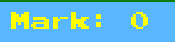

[[English]](README_en.md)

# Try Catch - HoangHaiUET

- Thử nghiệm game: [............................](.......)

# Giới thiệu game

Try_Catch là 1 game thuộc thể loại game thiếu nhi . Nhiệm vụ của bạn là điều khiển chú mèo máy Doraemon tới những vị trí thích hợp để nhặt được những chiếc bánh đồng thời né tránh những quả bom gây nguy hiểm cho Doraemon . Hãy cố gắng hết sức để đem về số điểm cao nhất  

- [0. Cách tải game](#0-cách-tải-game)
    * [ Bao gồm code và có thể biên dịch.](#bao-gồm-code-và-có-thể-biên-dịch)
- [1. Bắt đầu game](#1bắt-đầu-game)
- [2. Các thành phần trong game:](#2-các-thành-phần-trong-game)
- [3. Cách chơi](#3-cách-chơi)
- [4. Kết thúc game](#4-kết-thúc-game)
- [Về đồ họa của game:](#về-đồ-họa-của-game)
- [Về source code game](#về-source-code-game)

# 0. Cách tải game

## Bao gồm code và có thể biên dịch.

**Bước 1:** Clone repo này về .  
Hoặc Chọn Code -> Download Zip 

- Tất cả code đều nằm trong thư mục src. 
- Có thể nhảy đến bước 5 để chơi luôn.

**Bước 2:** Vào thư mục Debug tìm đến thư mục `GameSDLCppDemo.exe` . 

# 1. Bắt đầu game

Chờ một chút rồi click vào nút “PLAY GAME” để bắt đầu chơi game.

Và người chơi sẽ ngay lập tức nhìn thấy mèo máy Doraemon 

# 2. Các thành phần trong game:

-    Bánh doyaki 
     : là 1 loại bánh trong game

-    Bánh ngọt 
     : là 1 loại bánh trong game

-   Bánh takoyaki 

-  Ngôi sao (Star) 

- Bomb : Là mối nguy trong game , khi chạm phải bạn sẽ thua cuộc

- Thanh điểm (mark bar): Là thanh bạn có thể theo dõi để xem điểm số bạn tích luỹ sau khi nhặt được những chiếc bánh

- Thanh mạng (heart bar): là thanh mạng của bạn nếu hết mạng thì bạn thua

- Bố cục game cơ bản:

 

# 3. Cách chơi

Dựa vào nút di chuyển -> hoặc <- để di chuyển Doraemon của bạn tới những vị trí thích hợp để nhặt những chiếc bánh. 

# 4. Chiến thắng và thất bại

- Bạn sẽ thất bại nếu va chạm với quả bom hoặc hết 3 mạng mặc định

---

### Về đồ họa của game:

[[Google - Canva]]

### Về source code game:

- Folder SDL Lib: 
    * Chứa các thư viện SDL : SDL_image, SDL_Ttf, SDL_Mixer,SDL ,DLL 
- Folder Debug: Chứa tất cả các thành phần của game: 
    * Chứa các tài nguyên của game : Hình ảnh , thư viện , font chữ trong game  
- Folder GameSDLCPPDemo: Chứa các file header và file cpp  
    *`BaseObject.h` và `BaseObject.cpp`: 
        + File khởi tạo các đối tượng chung trong game : Nhân vật , các loại bánh  
        + Khởi tạo hàm Show ảnh của đối tượng trên BackGround game  
        + Cài đặt vị trí của các đối tượng thông qua `SDL_Rect`  
        + Các hàm Set và Get `SDL_Rect`  
    *`CakeObject.h` và `CakeObject.cpp`:  
        + Khởi tạo các Cake (có thể coi là các threat trong game) 
        + Hàm di chuyển các `Cake` <`HandleMove`> dựa vào `y_val` và có thể set trong main.cpp 
    *`Common_Function.h` và `Common_Function.cpp`: 
        + Đây là file nguồn chứa tất cả các thư viện và các hàm chung cơ bản nhất được sử dụng trong tất cả các đối tượng  
        + Khởi tạo màn hình Game < Window > cài đặt kích thước cửa sổ , quản lý tên các đối tượng trong project 
        + Khởi tạo các hàm `LoadImage` , `CleanUp` , `CheckCollision` < Xử lí va chạm> , `ShowMenu` 
    *`ExplosionObject.h` và  `ExplosionObject.cpp` : Cài đặt hình ảnh khi va chạm (Cụ thể là bom nổ)  
    *`MainObject.h` và `MainObject.cpp` :  
        + Khởi tạo nhân vật của game , cài đặt các thuộc tính cho nhân vật  
        + Hàm xử lý bắt sự kiện từ bàn phím `SDL_Event` 
    *`PlayerPower.h` và `PlayerPower.cpp` : Khởi tạo các heart (mạng của nhân vật) , xử lí hình ảnh khi thêm , bớt 
    *`TextObject.h`và `TextObject.cpp` : Cài đặt Font chữ trong game và các đối tượng cần hiện Text 
    *`main.cpp` : Xử lý chung trong game 
        + Khởi tạo cửa sổ màn hình  
        + Khởi tạo nhân vật , bánh , bom (threats)  
        + Khởi tạo các Text 
        + Load các hình ảnh : BackGround , human_object , Cake_object , Menu , Exit  
        + Load các Text , load Explosion  
        + Xử lí luật chơi : Khi va chạm sẽ được tăng điểm trên thanh điểm , khi va chạm phải bomb hoặc hết mạng thì sẽ bị tính là thua cuộc  
        + Khi va chạm , các Cake_Object sẽ được Reset  
        + Xử lí bộ nhớ sau khi thoát game  

`Luật chơi` 
        *   Di chuyển Doraemon tới những chiếc bánh và tránh xa những quả bomb 
        *   Khi va chạm phải quả bomb hoặc hết mang bạn sẽ thua  
        *   Bắt được 1 chiếc bánh sẽ được 30 điểm , 50 điểm nhưng khi để rơi 1 chiếc bánh sẽ mất 1 mạng  
        *   Khi không bắt được ngôi sao hy vọng bạn sẽ không bị trừ mạng
        *   Ngôi sao hi vọng sẽ chỉ mang về cho bạn 10 điểm nhưng tích đủ 10 ngôi sao sẽ hồi phục 1 mạng  
        *   Việc đột ngột di chuyển ngược chiều sẽ khiến Doraemon bị đứng lại do `quán tính`  
        *  Thua cuộc trong trạng thái đang di chuyển sẽ khiến Doraemon gặp trục trặc về bộ nhớ ở vòng chơi sau , bạn cần giữ nút di chuyển và thả nút di chuyển để Doraemon tỉnh lại  